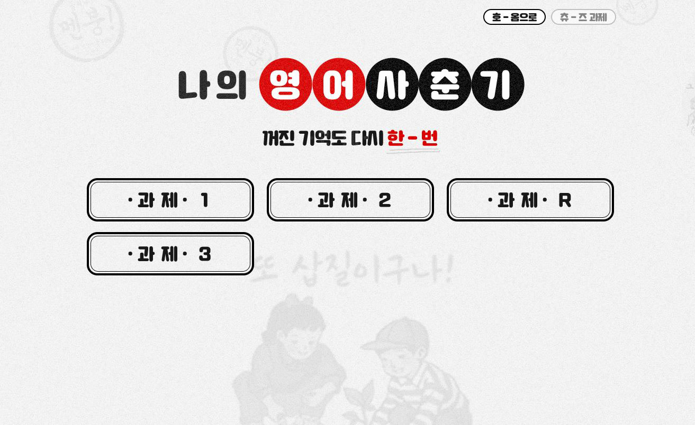
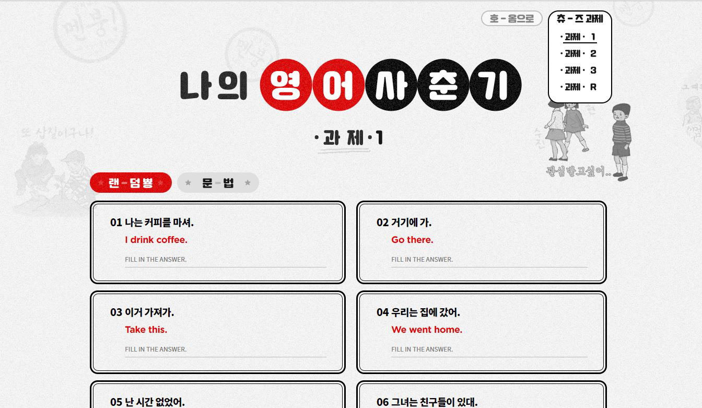

## tvN 나의 영어 사춘기 과제를 공부하기 위한 사이트

reactjs 와 나의 영춘기 과제 csv파일을 사용한 영어문장 외우는 사이트<br>
/1/2 or /1 /2 /3 or /1/2/3을 통하여 각 주차별 과제를 통합하여 불러오고<br>
불러진 리스트중 shuffle 30 버튼을 통해 30가지 문장을 랜덤으로 추출한다.

## Folder Structure

After creation, your project should look like this:

```
my-app/
  README.md
  node_modules/
  package.json
  public/
    index.html
    homework1.csv
    homework2.csv
    homework3.csv
    favicon.ico
  src/
    client/
      Root.js
    components/
      EnList.js
      EnListItem.js
      Home.js
      Homework.js
      Navbar.js  
    App.css
    App.js
```

## Development

Nodejs 및 Npm 설치 후,
```
# Install Packages
npm install
# Run Dev
npm start
    
```

## Screenshot



## Design By

변지현(ji hyun)
UX/UI Designer
bjoj91@naver.com 

